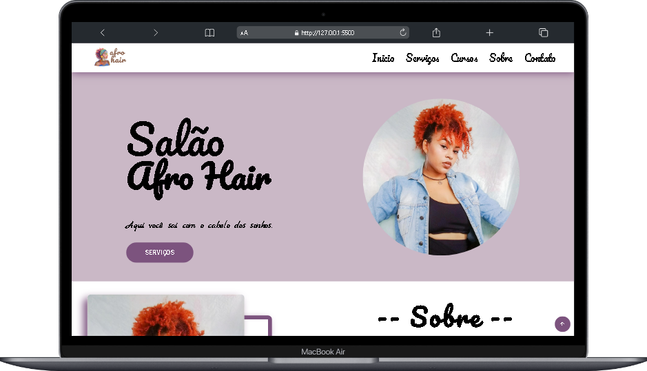

# Afro Hair

 

# 📋 Sobre o Afro Hair

    Afro Hair é um site comercial e informativo dedicado ao salão de beleza especializado em cabelos afro. A plataforma oferece uma variedade de informações essenciais para os clientes, incluindo detalhes sobre serviços, produtos disponíveis, canais de comunicação e horários de funcionamento. Além de espaço com feedbacks e depoimentos de clientes.

    Com o objetivo de valorizar a beleza natural dos cabelos afro e promover a autoestima de clientes. Através do site, buscamos oferecer um espaço acolhedor e informativo, onde os visitantes possam encontrar todas as informações sobre o Afro Hair.

# ©️ Diretos

<h2>
    Gabrielle Santos
</h2>

    <strong>Empreendedora</strong>
     
    <strong>Trancista</strong>
     
    <a href="https://www.instagram.com/gabrielle_santos_afro_hair/">
        @gabrielle_santos_afro_hair
    </a>

# 💻 Desenvolvedores
- <a href="">Geovanny Diniz</a>
- <a href="https://github.com/RaquelStefany/">Raquel Stefany</a>
- <a href="https://github.com/valeria-ferreira/">Valéria Ferreira</a>

# 💻 Tecnologias

  
     
      
    

